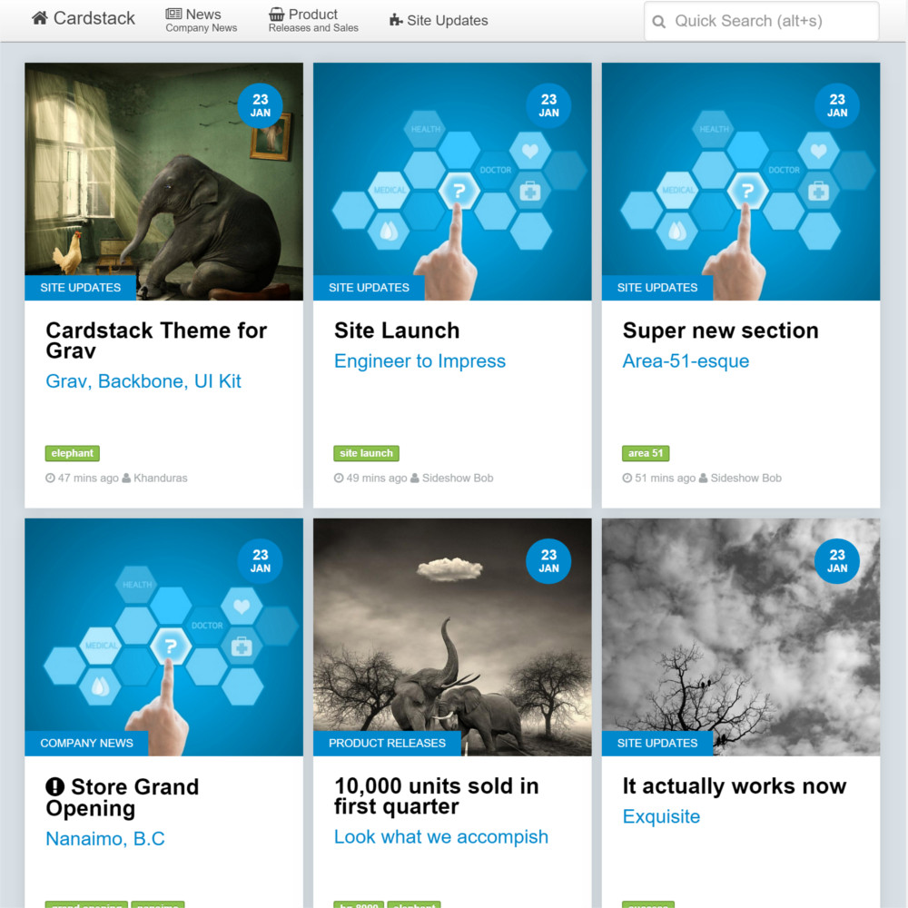

# Cardstack

Cardstack is a single page application page powered with [Grav CMS](https://getgrav.org/), [BackboneJS](http://backbonejs.org/) and [UI Kit](http://getuikit.com/).



[Demo](http://demos.chiefqualakon.net/cardstack/)

# Installation

There are three ways to install Cardstack. The preferred method is using the Admin Panel as there are many options that can be changed with that interface. Optionally, you can use the [Grav Package Manager (GPM)](http://learn.getgrav.org/advanced/grav-gpm) and install using a CLI. Finally, you may choose to download the theme manually from Github and copy to your themes folder.

## Admin Panel (Preferred)

Installing from the Admin Panel is the easiest if the Admin plugin is already installed.

* Login to your Admin Panel
* Select **Themes** on the left menu
* Select the **Add** button at the top menu
* Find and select Cardstack 
* Install!

This will install the Cardstack theme into your `/user/themes` directory within Grav. Its files can be found under `/your/site/grav/user/themes/cardstack`.

Once installed you will have to go back to themes to activate it.

## GPM Installation

The second easiest way to install this theme is via the [Grav Package Manager (GPM)](http://learn.getgrav.org/advanced/grav-gpm) through your system's Terminal (also called the command line).  From the root of your Grav install type:

``` 
bin/gpm install cardstack
```

Exactly like the Admin Panel install, it will create a `cardstack` directory in your `/user/themes` directory.

## Manual Installation

To install this theme, just download the zip version of this repository and unzip it under `/your/site/grav/user/themes`. Then, rename the folder to `cardstack`. You can find these files either on [GitHub](https://github.com/getgrav/grav-theme-cardstack) or via [GetGrav.org](http://getgrav.org/downloads/themes).

You should now have all the theme files under

``` 
/your/site/grav/user/themes/cardstack
```

# Updating

As development for the Cardstack theme continues, new versions may become available that add additional features and functionality, improve compatibility with newer Grav releases, and generally provide a better user experience. Updating Cardstack is easy, and can be done through the Admin Panel, Grav's GPM system, as well as manually.

## Admin Panel

When new updates for Cardstack become available you'll be able to see the update available on the left menu. From the Dashboard you are able to update all available plugin and themes. If you select **Themes** you can see just the themes that need updating. 

## GPM Update

The simplest way to update this theme is via the [Grav Package Manager (GPM)](http://learn.getgrav.org/advanced/grav-gpm). You can do this with this by navigating to the root directory of your Grav install using your system's Terminal (also called command line) and typing the following:

``` 
bin/gpm update cardstack
```

This command will check your Grav install to see if your Cardstack theme is due for an update. If a newer release is found, you will be asked whether or not you wish to update. To continue, type `y` and hit enter. The theme will automatically update and clear Grav's cache.

## Manual Update

Manually updating Cardstack is pretty simple. Here is what you will need to do to get this done:

* Delete the `your/site/user/themes/cardstack` directory.
* Download the new version of the Cardstack theme from either [GitHub](https://github.com/getgrav/grav-plugin-cardstack) or [GetGrav.org](http://getgrav.org/downloads/themes#extras).
* Unzip the zip file in `your/site/user/themes` and rename the resulting folder to `cardstack`.
* Clear the Grav cache. The simplest way to do this is by going to the root Grav directory in terminal and typing `bin/grav clear-cache`.

> Note: Any changes you have made to any of the files listed under this directory will also be removed and replaced by the new set. Any files located elsewhere (for example a YAML settings file placed in `user/config/themes`) will remain intact.

## Features

* BackboneJS theme for Grav
* Built with UI Kit framework
* Card-style layout pulls from Grav's pages
* Mobile ready! Responsive layout
* Page blueprints for Cards and Authors
* Quick Search to filter by string 
* Category and Tag taxonomy filtering
* Custom navbar menu items for front page and all child pages
* Language file for easy translation (Pull requests welcomed)
* Languages avaialable: `en`, `fr`

### Supported Page Templates

* Default view template
* CardStack view template
* CardCategory view template
* Card item view template
* Author view template

### Supported 3rd Party Plugins

* [TaxonomyList](https://github.com/getgrav/grav-plugin-taxonomylist)
* [Editor Buttons](https://github.com/getgrav/grav-plugin-editor-buttons)

### Pages Hierarchy

Cardstack uses hard coded pages to look for cards. As such, make sure you have a layout that looks like the following:

``` 
/user
  - /front_page | default.html.twig (Home)
  - /pages
    - /cards | cardstack.html.twig
      - /<category> | card_category.html.twig
        -/card.md
        -/card.md
        -/card.md
        - etc..
      - /<category> | card_category.html.twig
        -/card.md
        -/card.md
        -/card.md
        - etc..
    - /authors | authors.html.twig
      - /<author>
        - /author.md
      - etc..
    - /menus | menus.html.twig
      - /navbar
        - /menu.md
```

### Card Features

##### Filter

Cards can be sorted based a variety of criteria, which is defined by the BackboneJS route. These relate the the taxonomies attached to the Grav Card page. 

Examples:

* ```/#category/<category>``` : Filter by Category Taxonomy
* ```/#keyword/<keyword>``` : Filter by Tag Taxonomy
* ```/#search/<terms>``` : Filter by the following:
  * Title
  * Subtitle
  * Summary
  * Category
  * Keywords
  * Slug
* ```/#author/<author>``` : Filter by Author
* ```/#page/<page_route>``` : Loads just the one Card with full detail

##### Sort

By default, Cards will be sorted by `page.header.date` no matter which view you are currently on.

##### Continue Link Pages

Cardstack supports the ability for a page to have a `link:` header option.  This will then in turn create a **link page** where the title of the page will actually be linked to the link provided and a prefexid double angle `>>` will link to the page itself.  Simply provide the link in the page header:

``` 
link: http://getgrav.org/blog
```

This will show up on both the Card and the Card's page.

### Page View Feature

Selecting a Card will bring up the route ```/#page/<page_route>```, full Page view. This view will make an AJAX call to the `card.htm.twig` template which is  customizable using both twig templating and Backbone/Underscore JS templating.

### Authors Feature

The route for Authors searches for a page at `/user/pages/authors/<author>` matching the author in the route `/#author/<author>`.  If found, it will load the content of that page using the same AJAX call and `author.htm.twig` template.

The `/#author/<author>` route will also display a list of Cards by that author.

### Menu Features

##### Categories

If the TaxonomyList plugin is installed you will see a drop down which shows a list of all the `category` taxonomy tags. Selecting one will only show the cards with that Category.

##### Page to Navbar

The top navbar menu is not created dynamically, instead create a page under `/users/pages/menus/navbar/menu.md`. Once created, you can use the Admin Panel plugin to make changes to this menu. Alternatively, you can use a text editor and copy the following:

``` yaml
items:
    1:
        title: News
        subtitle: 'Company News'
        url: '/cardstack/#company_news'
        icon: newspaper-o
        fore_color: ''
        back_color: ''
        li_class: nav_menu_front_page
        anchor_class: ''
    2:
        title: Product
        subtitle: 'Releases and Sales'
        url: '/cardstack/#product_releases'
        icon: shopping-basket
        fore_color: ''
        back_color: ''
        li_class: nav_menu_front_page
        anchor_class: ''
    3:
        title: 'Site Updates'
        subtitle: ''
        url: '/cardstack/#site_updates'
        icon: puzzle-piece
        fore_color: ''
        back_color: ''
        li_class: nav_menu_front_page
        anchor_class: ''
    4:
        title: Back
        subtitle: ''
        url: '/cardstack/#'
        icon: mail-reply
        fore_color: ''
        back_color: ''
        li_class: 'nav_menu_child_menu hidden'
        anchor_class: ''
```

# Setup

If you want to set Cardstack as the default theme, you can do so by following these steps:

* Navigate to `/your/site/grav/user/config`.
* Open the **system.yaml** file.
* Change the `theme:` setting to `theme: cardstack`.
* Save your changes.
* Clear the Grav cache. The simplest way to do this is by going to the root Grav directory in Terminal and typing `bin/grav clear-cache`.

Once this is done, you should be able to see the new theme on the frontend. Keep in mind any customizations made to the previous theme will not be reflected as all of the theme and templating information is now being pulled from the **cardstack** folder.

## Getting Started

Helpful first steps.

### Card  Hierarchy

Once Cardstack is your active theme you'll want to create the page hierarchy. There are templates to follow and the Card hierarchy is like this:

``` 
/pages
  /cardstack.md
    /card_category.md
      - card.md
```

The `card_category.twig.html` is not 100% necessary, if a card is without a parent `category` then its name will be the category. Grouping Cards in these Category directories will provide a fallback Category if there are no Category taxonomies present on the Card.

### Menu Hierarchy

The `navbar` menu is also a Page that has to be created and configured. Menu hierarchy is like this:

``` 
/pages
  /menus.md
    /navbar
       - menu.md
```

### Author Hierarchy

When `page.header.author.name` is referenced on Cards and Pages Grav will search `{{ baseurl }}/authors/{{ author.name }}.htm` with a few twig filters to normalize the request. If there's an Author Page at that location, it will perform an AJAX request to retrieve that html and display it.

## Report Issues

I'd appreciate to know what's broken with this theme and how it can be improved.


